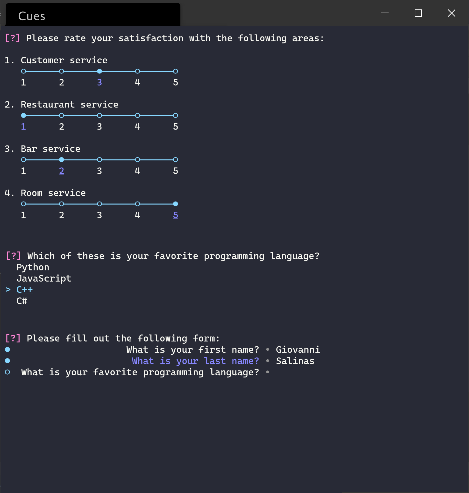

Cues
====

`Cues` is a Python library for creating elegant and sophisticated prompts to inquire and ask for input at the command line.

.. note::
   This library is compatible with Windows, macOS, and Linux and requires a Python version of 3.6 or higher.

   *A snapshot showing the Survey, Select, and Form classes (from top to bottom)*

Overview
--------

Features

- Beautiful and easy-to-use prompts

Table of contents
-----------------

.. toctree::
   :maxdepth: 4
   :caption: Contents:

   pages/install
   pages/cues
   pages/gallery

Indices and tables
==================

* :ref:`genindex`
* :ref:`modindex`
* :ref:`search`