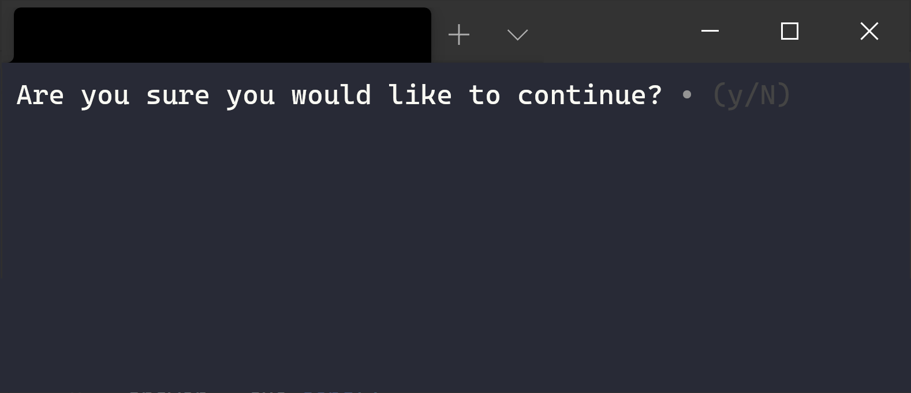

Confirm
=======

This page will explain how to use the ``Confirm`` cue of the `Cues` library.

``Confirm`` objects are useful for asking simple yes-no questions. The result is a ``dict`` containing a boolean value.

Before we start, make sure you have `Cues` `installed <../install.html>`_.

Setting up
----------

``Confirm`` objects have two required parameters:

+------------+------------+------------+------------+
| Parameters | Type       | Optional   | Default    |
+============+============+============+============+
| name       | str        | No         |            |
+------------+------------+------------+------------+
| message    | str        | No         |            |
+------------+------------+------------+------------+

The signature for the ``init`` method of a ``Confirm`` object:
::

    def __init__(self, name, message):
        # ...

We first need to start by importing ``Confirm`` from the `Cues` library:
::

    from cues import Confirm

Now, we need to instantiate a ``Confirm`` object. We can do this with a little bit of setup by initializing some variables:
::

    name = 'continue'
    message = 'Are you sure you would like to continue?'

That's it. The ``Confirm`` cue is the simplest of them all.

In the code above, we created the variables ``name`` and ``message``:

- ``name`` will be used to retrieve the results from a ``Confirm`` object
- ``message`` is the text that will be displayed to the user

Now that our setup is complete, we can go ahead and initialize a ``Confirm`` object and ask the user to respond to our ``message`` by invoking our instance's ``send`` method:
::

    cue = Confirm(name, message)
    answer = cue.send()

When you "send" the cue to the user, they will be presented with something that looks like the following:

   *The Confirm cue*

At this point, the user can respond by entering one of the four keys:

- 'n'
- 'N'
- 'y'
- 'Y'

After receiving one of those inputs, a ``dict`` object will be returned consisting of a key-value pair of your ``name`` string and a boolean. The result will resemble the following:
::

    {
        'continue': True
    }

Instantiating from a dict
-------------------------

In the previous example, we initialized separte variables for the ``__init__`` method of a ``Confirm`` object. *However*, we could also make use of the class's ``from_dict`` classmethod and instantiate by using a ``dict`` instead:
::

    from cues import Confirm

    confirm_dict = {
        'name': 'continue',
        'message': 'Are you sure you would like to continue?'
    }

    cue = Confirm.from_dict(confirm_dict)
    answer = cue.send()

The names for the *values* in this ``dict`` must be the same as the names of the parameters in the ``__init__`` method.