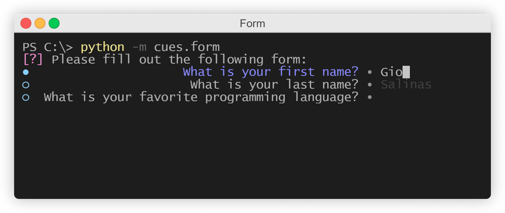

Form
====

This page will explain how to use the ``Form`` cue of the `Cues` library.

``Form`` objects are useful for asking input from users for a series of prompts by having them type their responses. Thus the expected responses should be ``str`` objects. The result is a ``dict`` containing a ``dict``.

Before we start, make sure you have `Cues` `installed <install.html>`_.

Setting up
----------

``Form`` objects have three required parameters:

+------------+------------+------------+------------+
| Parameters | Type       | Optional   | Default    |
+============+============+============+============+
| name       | str        | No         |            |
+------------+------------+------------+------------+
| message    | str        | No         |            |
+------------+------------+------------+------------+
| fields     | iterable   | No         |            |
+------------+------------+------------+------------+

The signature for the ``__init__`` method of a ``Form`` object:
::

    def __init__(self, name, message, fields):
        # ...

We first need to start by importing ``Form`` from the `Cues` library:
::

    from cues import Form

Now, we need to instantiate a ``Form`` object. We can do this with a little bit of setup by initializing some variables:
::

    name = 'basic_info'
    message = 'Please fill out the following form:'
    fields = [
        {
            'name': 'first_name',
            'message': 'First name'
        },
        {
            'name': 'last_name',
            'message': 'Last name'
        },
        {
            'name': 'username',
            'message': 'Username'
        }
    ]

In the code above, we created the variables ``name`` and ``message``:

- ``name`` will be used to retrieve the results from a ``Form`` object
- ``message`` is the text that will be displayed to the user

In addition to those, we also created a ``fields`` variable. This will be used to populate the form's prompts to which the user will need to respond. This variable can be any iterable that contains ``dict`` objects with *name* and *message* keys.

Now that our setup is complete, we can go ahead and initialize a ``Form`` object and ask the user to respond to our ``fields`` by invoking our instance's ``send`` method:
::

    cue = Form(name, message, fields)
    answer = cue.send()

When you "send" the cue to the user, they will be presented with something that looks like the following:

   *The Form cue*

The user will not be expected to answer these prompts by typing their responses. Once the user has finished, a ``dict`` containing another ``dict`` will be returned. The inner-``dict`` will consist of key-value pairs of your ``fields`` and the user's responses respectively. The result will resemble the following:
::

    {
        'first_name': 'Giovanni',
        'last_name': 'Salinas',
        'username': 'GBS3'
    }

Using defaults
^^^^^^^^^^^^^^

A handy option you have with forms is the ability to set a default response. This can save the user some time and can make forms flexible by introducing a dynamic element.

Let's run through a quick example. Let's say you're in a situation where you need to ask the user which operating system is their favorite. Maybe it's the operating system that they're currently using. Well, we have a couple of ways to figure out the OS they're using. One way is to use the ``platform`` module in the Python Standard Library:
::

    import platform

    user_os = platform.system()

Now, we construct a ``Form`` but insert their OS as a default response:
::

    from cues import Form

    name = 'favorite_os'
    message = "Please fill out the following form (which really isn't much of a form):"
    fields = [
        {
            'name': 'favorite_os',
            'message': 'What is your favorite operating system?',
            'default': user_os
        }
    ]

By including a `default` key, the ``Form`` will display the user's operating system in greyed-out text to indicate to the user that it's there by default. If the user doesn't agree with the default choice, no worries; the moment they begin typing, the default text will disappear. In other words, they won't have to hold the Backspace key to remove the default text.

Instantiating from a dict
-------------------------

In the previous example, we initialized separte variables for the ``__init__`` method of a ``Form`` object. *However*, we could also make use of the class's ``from_dict`` classmethod and instantiate by using a ``dict`` instead:
::

    from cues import Form

    form_dict = {
        name = 'basic_info'
        message = 'Please fill out the following form:'
        fields = [
            {
                'name': 'first_name',
                'message': 'First name'
            },
            {
                'name': 'last_name',
                'message': 'Last name'
            },
            {
                'name': 'username',
                'message': 'Username'
            }
        ]
    }

    cue = Form.from_dict(form_dict)
    answer = cue.send()

The names for the *values* in this ``dict`` must be the same as the names of the parameters in the ``__init__`` method.