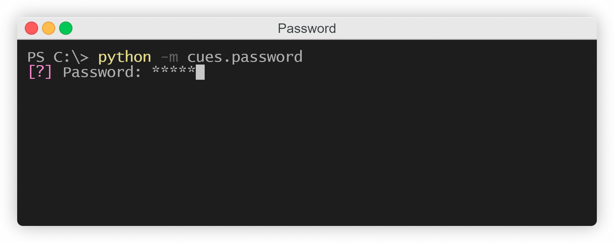
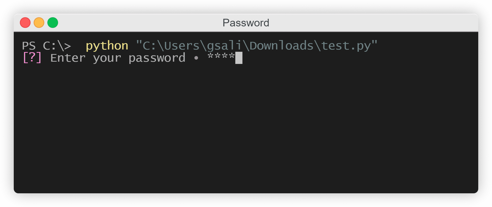

Password
========

This page will explain how to use the ``Password`` cue of the `Cues` library.

``Password`` objects are useful when you need input from the user but would prefer their input be hidden while they type as it may contain sensitive information. The expected input is a ``str`` object. The result is a ``dict`` containing a ``str``.

Before we start, make sure you have `Cues` `installed <../install.html>`_.

Setting up
----------

``Password`` objects have three required parameters:

+------------+------------+------------+------------+
| Parameters | Type       | Optional   | Default    |
+============+============+============+============+
| name       | str        | No         |            |
+------------+------------+------------+------------+
| message    | str        | No         |            |
+------------+------------+------------+------------+

The signature for the ``__init__`` method of a ``Password`` object:
::

    def __init__(self, name, message):
        # ...

With that out of the way, we first need to start by importing ``Password`` from the `Cues` library:
::

    from cues import Password

Now, we need to instantiate a ``Password`` object. We can do this with a little bit of setup by initializing some variables:
::

    name = 'password'
    message = 'Password:'

In the code above, we created the variables ``name`` and ``message``:

- ``name`` will be used to retrieve the results from a ``Password`` object
- ``message`` is the text that will be displayed to the user

That's it! Our setup is complete. We can now go ahead and initialize a ``Password`` object to ask the user to enter a password by invoking the object's ``send`` method:
::

    cue = Password(name, message)
    answer = cue.send()

When you "send" the cue to the user, they will be presented with something that looks like the following:

   *The Password cue*

As the user types, asterisks will appear where their input normally would if you were to use Python's built-in ``input`` function. The user can use the Backspace/Delete key to undo any mistakes or reset their input. Once they're done, they can hit the Enter key and a ``dict`` will be returned with a ``str`` object:
::

    {'password': '1234'}

Two formats
-----------

There are two possible formats that can be used for displaying the `message` to the user: one that ends with a bullet point and one that doesn't.

If your message ends with an alphanumerical character (A-Z | 0-9), then a bullet point will separate the message you provide and the user's input:

   *The Password cue*

Otherwise, if your message ends with a colon or a question mark, the only thing separating your message and the user's input will be one whitespace character:

   *The Password cue*

Instantiating from a dict
-------------------------

In the previous example, we initialized separte variables for the ``__init__`` method of a ``Password`` object. *However*, we could also make use of the class's ``from_dict`` classmethod and instantiate by using a ``dict`` instead:
::

    from cues import Password

    password_dict = {
        'name': 'password',
        'message': 'Password:'
    }

    cue = Password.from_dict(password_dict)
    answer = cue.send()

The names for the *values* in this ``dict`` must be the same as the names of the parameters in the ``__init__`` method.