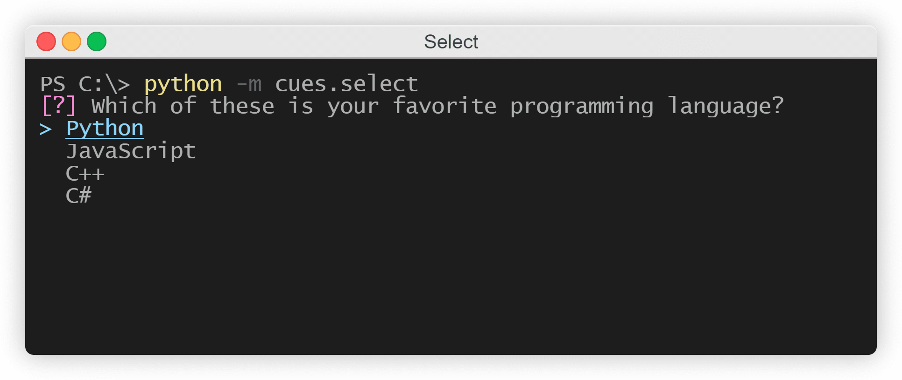

Select
======

This page will explain how to use the ``Select`` cue of the `Cues` library.

``Select`` objects are useful when you need a user to select a single option out of a list of options. The result is a ``dict`` containing a ``str``.

Before we start, make sure you have `Cues` `installed <../install.html>`_.

Setting up
----------

``Select`` objects have three required parameters:

+------------+------------+------------+------------+
| Parameters | Type       | Optional   | Default    |
+============+============+============+============+
| name       | str        | No         |            |
+------------+------------+------------+------------+
| message    | str        | No         |            |
+------------+------------+------------+------------+
| options    | iterable   | No         |            |
+------------+------------+------------+------------+

The signature for the ``__init__`` method of a ``Select`` object:
::

    def __init__(self, name, message, options):
        # ...

We first need to start by importing ``Select`` from the `Cues` library:
::

    from cues import Select

Now, we need to instantiate a ``Select`` object. We can do this with a little bit of setup by initializing some variables:
::

    name = 'programming_language'
    message = 'Which one is your favorite programming language?'
    options = [
        'Python',
        'JavaScript',
        'C++',
        'C#'
    ]

In the code above, we created the variables ``name`` and ``message``:

- ``name`` will be used to retrieve the results from a ``Select`` object
- ``message`` is the text that will be displayed to the user

In addition to those, we also created a ``options`` variable. This will be used to present a list of options for the user to pick from. This variable can be any iterable that contains ``str`` objects.

Now that our setup is complete, we can go ahead and initialize a ``Select`` object and ask the user to select one of our ``options`` by invoking our instance's ``send`` method:
::

    cue = Select(name, message, options)
    answer = cue.send()

When you "send" the cue to the user, they will be presented with something that looks like the following:

   *The Select cue*

Once the user is done perusing and has selected an option, a ``dict`` consisting of the ``name`` variable and the option the user chose will be returned. The result will resemble the following:
::

    {'programming_language': 'Python'}

Instantiating from a dict
-------------------------

In the previous example, we initialized separte variables for the ``__init__`` method of a ``Select`` object. *However*, we could also make use of the class's ``from_dict`` classmethod and instantiate by using a ``dict`` instead:
::

    from cues import Select

    select_dict = {
        name = 'programming_language'
        message = 'Which one is your favorite programming language?'
        options = [
            'Python',
            'JavaScript',
            'C++',
            'C#'
        ]
    }

    cue = Select.from_dict(select_dict)
    answer = cue.send()

The names for the *values* in this ``dict`` must be the same as the names of the parameters in the ``__init__`` method.