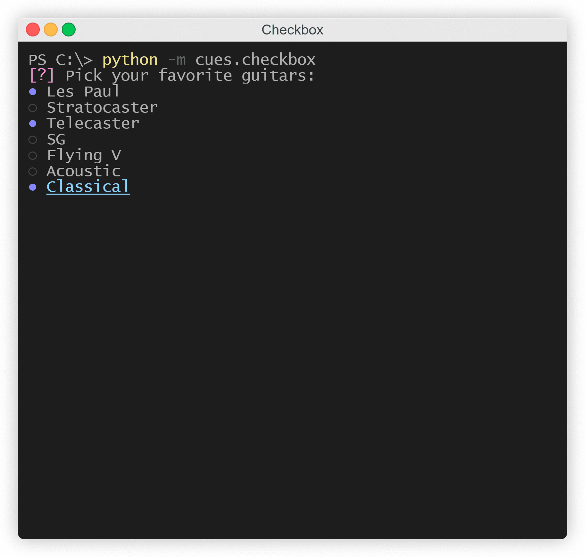
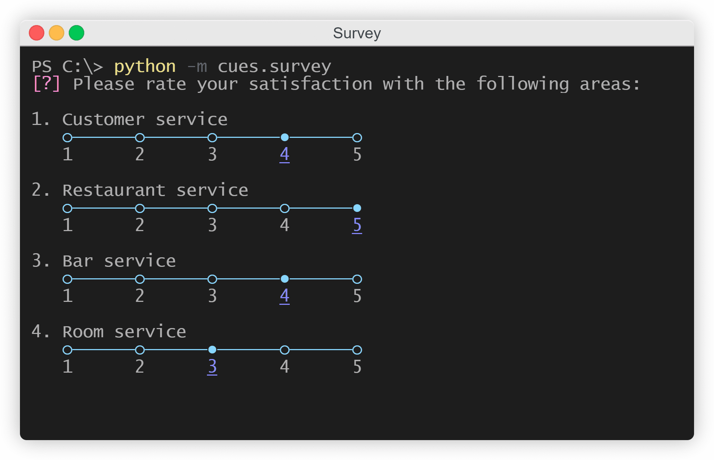

Gallery
=======

Welcome to the gallery. Here, you can see quick snapshots of each of the individual cues in order to get an idea of how they would look in a terminal and to decide if they're right for your use case.

.. note::
   This section only contains images of the different cues. If you would like to run an interactive example of them directly from your terminal to get a better understanding of how they work, please enter the following line in your terminal:

    ``python -m cues.<cue>``

   For example:

    ``python -m cues.survey``

Checkbox
--------

   *The Checkbox cue*

Confirm
-------

.. figure:: ../_static/confirm.png
   :width: 600px
   :align: center
   :alt: confirm snapshot
   :figclass: align-center

   *The Confirm cue*

Form
----

.. figure:: ../_static/form.png
   :width: 600px
   :align: center
   :alt: form snapshot
   :figclass: align-center

   *The Form cue*

Select
------

.. figure:: ../_static/select.png
   :width: 600px
   :align: center
   :alt: select snapshot
   :figclass: align-center

   *The Select cue*

Survey
------

   *The Survey cue*